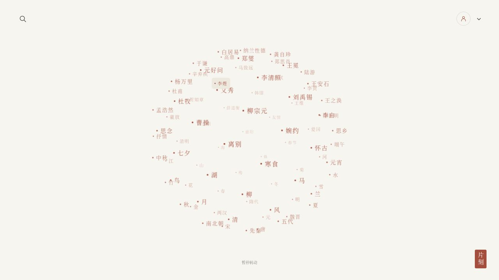
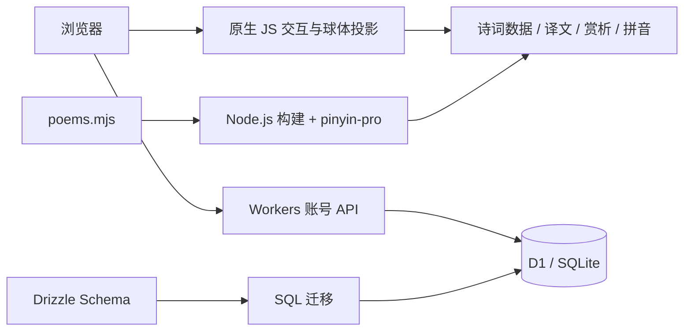

<div align="center">

# 片刻 · Poetry Moment

**留一点时间，给诗。**

在纸间朱砂与夜空星河之间，循一颗星，遇见一首诗。


[界面预览](#界面预览) · [项目亮点](#项目亮点) · [技术栈](#技术栈) · [本地运行](#本地运行) · [内容扩展](#内容扩展)

</div>

---

片刻是一款以阅读为中心的极简诗词网站。打开页面，一句随机诗词缓缓浮现；约三秒后，诗句淡出，分类结点组成的球体开始缓慢旋转。朝代、四时、意象与作者散落其中，点击结点，逐层走进一首诗。

当前版本包含 **55 首诗词 · 52 个主题 / 朝代分类 · 32 位具名诗人**。另有佚名作品；同一首诗可以归入多个分类。这里是一份可运行、可继续扩展的精选诗词集，并非全量古诗词数据库。

## 界面预览

> 以下均为项目实际运行截图，图片随仓库保存，不依赖临时图床。

<table>
  <tr>
    <td width="50%" align="center"><strong>纸间朱砂</strong><br><sub>暖白底色 · 朱红结点 · 大面积留白</sub></td>
    <td width="50%" align="center"><strong>夜空星河</strong><br><sub>深邃夜色 · 发光星点 · 同一片开场星空</sub></td>
  </tr>
  <tr>
    <td></td>
    <td></td>
  </tr>
</table>

### 一首诗，一个安静的阅读空间

居中排版保留原文与作者信息。右下角三个小按钮，让译文、赏析和拼音按需出现。


## 项目亮点

### 01 · 可以游走的诗词球体

- 通过**斐波那契球面分布**安排结点，以三维旋转和透视投影生成空间层次。
- 使用原生 DOM 按钮与 CSS transform 渲染，结点保持可点击、可聚焦，无需 Three.js 或 WebGL。
- 球体默认缓慢自转；鼠标移动影响俯仰，拖动可直接改变姿态。
- 滚轮控制方向与速度，反向滚动可改变转向，停止后以指数衰减逐渐回到默认自转。
- 分类页继续以球体展示诗名，只保留简洁的分类标题。

### 02 · 两种主题，同一种留白

- 浅色：暖白纸面、墨色文字、朱红结点与印章。
- 深色：Canvas 绘制星空，结点以亮度和光晕呈现远近。
- 深色开场与主页共享星空背景，淡出过渡自然衔接。
- 主题偏好保存在当前浏览器，支持暂停和减少动态效果。

### 03 · 原文、译文、赏析、拼音

| 按钮 | 作用 |
| :---: | --- |
| **译** | 展开或收起本站编写的现代汉语译文 |
| **赏** | 展开或收起作品赏析 |
| **音** | 通过 HTML ruby / rt 在汉字上方标注拼音，不是音频朗读 |

拼音在构建时生成，针对部分古诗多音字增加自定义读音。译文、赏析和拼音仍需持续校订。

### 04 · 轻量搜索与真实账号

- 按诗名、诗句片段、作者、朝代、意象检索，结合包含匹配与按顺序的非连续字符匹配进行排序。
- 邮箱密码注册，注册前必须勾选用户协议，成功后自动登录。
- 账号与会话存入服务端 D1，浏览器不保存明文密码。
- 密码采用随机盐和 PBKDF2-SHA256 派生；会话 Cookie 使用 HttpOnly、Secure、SameSite=Lax，数据库仅保存会话令牌的 SHA-256 摘要。
- 配有同源检查、认证尝试限流、七天会话过期和退出登录。

### 05 · 为交互和扩展留出空间

支持键盘聚焦、触屏拖动、响应式布局及 `prefers-reduced-motion`。浏览器支持 WebMCP 时，可注册 `search_poems`、`open_poem` 两个工具；不支持该接口的浏览器仍能正常使用全部页面功能。

## 技术栈

| 层级 | 技术 | 在项目中的用途 |
| --- | --- | --- |
| 页面 | HTML5、CSS3、原生 JavaScript / ESM | 单页交互、主题、Hash 路由和阅读布局 |
| 动画 | requestAnimationFrame、CSS transform、Canvas 2D | 球面投影、惯性旋转与星空背景 |
| 服务端 | Cloudflare Workers | 页面资源与账号 API |
| 数据 | Cloudflare D1 / SQLite | 用户、会话及认证尝试记录 |
| 数据迁移 | Drizzle ORM、Drizzle Kit | TypeScript Schema 与 SQL 迁移生成；运行时查询使用 D1 prepared statements |
| 拼音 | pinyin-pro | 构建时生成逐字拼音和多音字覆盖 |
| 本地开发 | Node.js、pnpm、Miniflare | 构建脚本、本地 Worker 与持久化 D1 模拟 |
| 测试 | node:test、node:assert | 分类覆盖与账号流程集成测试 |
| 临时分享 | Cloudflare Quick Tunnel（可选） | 将本地服务临时映射为 HTTPS 地址 |



## 本地运行

建议使用 **Node.js 24**、**pnpm 11**（本项目的构建与测试环境）。首次运行需要下载依赖。

```bash
git clone https://github.com/sunye-cn/poetry_moment.git
cd poetry_moment
pnpm install
pnpm build
pnpm dev
```

打开 **http://localhost:4387**。首次启动会初始化本地数据库，数据保存在 `.dev-data/`；该目录不提交到 Git。修改页面或诗词内容后，重新执行 `pnpm build` 并重启 `pnpm dev`，当前预览脚本不提供热更新。

| 命令 | 说明 |
| --- | --- |
| `pnpm build` | 将页面、样式、脚本和拼音数据打包进 Worker 输出 |
| `pnpm dev` | 在 4387 端口启动 Miniflare 预览 |
| `pnpm test` | 运行临时数据库集成测试及分类内容检查 |
| `pnpm exec drizzle-kit generate` | 修改 `db/schema.ts` 后生成新的迁移 |

测试覆盖分类有内容、注册协议校验、跨来源拒绝、重复注册、密码登录、会话保持、过期、退出与认证限流。

### 可选：Cloudflare 临时网址

安装 Cloudflare 官方 `cloudflared` 后，启动隧道：

```bash
cloudflared tunnel --url http://localhost:4387 --no-autoupdate
```

复制工具实际输出的 HTTPS 地址，再用该地址启动本地服务（若已有预览进程，先停止它）：

```bash
POETRY_PUBLIC_ORIGIN=https://实际生成的地址.trycloudflare.com pnpm dev
```

`POETRY_PUBLIC_ORIGIN` 让本地 Worker 使用固定的公开来源，保留账号 API 的同源检查。临时网址依赖本机与隧道进程，不是长期托管；本地账号数据与线上 D1 分开。

## 项目结构

```text
poetry_moment/
├── src/
│   ├── index.html          # 页面、弹窗与基础用户协议
│   ├── style.css           # 明暗主题、球体与阅读排版
│   ├── app.js              # 交互、搜索、路由与账号界面
│   ├── poems.mjs           # 诗词原文、分类与本站译解
│   └── worker.mjs          # 服务端资源和账号 API
├── db/schema.ts            # D1 数据模型
├── drizzle/                # SQL 迁移与迁移元数据
├── scripts/
│   ├── build.mjs           # 拼音与 Worker 构建
│   └── preview.mjs         # 本地 D1 初始化和服务启动
├── tests/auth.test.mjs      # 数据覆盖与账号集成测试
├── docs/screenshots/       # README 真实运行截图
└── dist/server/            # 可重新生成的 Worker 构建产物
```

## 内容扩展

在 `src/poems.mjs` 中增加条目，每条包含 **标题、作者、朝代、原文、标签、译文、赏析**。原文以 `|` 分隔显示行，标签以空格分隔。重新构建后会生成拼音；新增多音字校对可维护在 `scripts/build.mjs` 的 `customPinyin` 中。

新增数据时，建议同时核对作者归属、文本版本、分类与读音，并补齐译文和赏析，保证每个入口都能完成完整阅读。

## 部署与当前边界

Worker 入口为 `dist/server/index.js`，需要一起部署生成的 `assets.generated.mjs`，并绑定名为 **DB** 的 D1 数据库。部署前应按顺序应用 `drizzle/` 中的 SQL 迁移。现有 `.openai/hosting.json` 是原 Sites 项目的部署标识；部署自己的副本时应使用自己的项目配置，不能直接复用此标识。

- 这是精选内容集，部分分类目前只有一两首；后续可继续扩大覆盖。
- 邮箱验证、密码找回、邮件发送、收藏同步和音频朗读暂未实现。
- 注册使用基础试用协议；正式运营时需要换成符合实际运营情况的文本。
- 当前本地预览只在空数据库上自动初始化 Schema。已有本地数据库新增迁移时，应单独应用迁移；不要通过删除数据库来迁移需要保留的账号数据。
- 古典原文为公版作品；现代译文和赏析为本站编写的阅读辅助。仓库目前未声明开源许可证，公开可见不代表授予任意再分发授权。

---

<div align="center">
<sub>一首诗，一个片刻。</sub>
</div>
